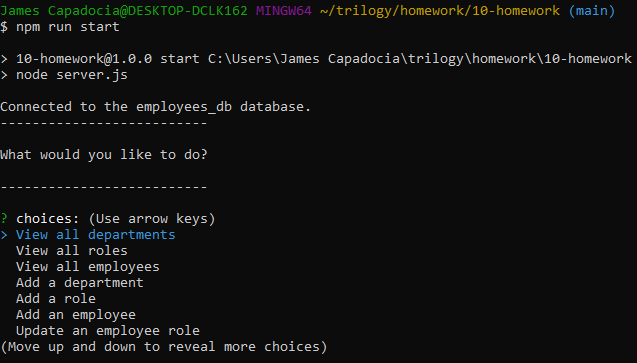

[](https://opensource.org/licenses/MIT)
  
# Employee Tracker

## Link to public repo on Github:

https://github.com/jcapadocia3/Employee-Tracker

## Table of Contents
1. [Description](#Description)
2. [Final Product Image and Video Walkthrough](#Final-Product-Image-and-Video-Walkthrough)
3. [User Story](#User-Story)
4. [Installation and Instructions](#Installation-and-Instructions)
5. [License](#License)
6. [Questions](#Questions)

## Description
The purpose of this project is to allow a user to access and manipulate a database that hosts specific employee information for a company. While the code written to allow this may be complex, the user will be guided through simple prompts to execute additions or updates to the database via the command line.

## Final Product Image and Video Walkthrough

- Image of final product created<br>


- Video walkthrough of how the project works via the command line<br>
<a target="_blank" href="https://watch.screencastify.com/v/UDQRWos5oEjXvCLx8Y4H">Click Here</a>

## User Story
```
GIVEN a command-line application that accepts user input

WHEN I start the application
THEN I am presented with the following options: view all departments, view all roles, view all employees, add a department, add a role, add an employee, and update an employee role

WHEN I choose to view all departments
THEN I am presented with a formatted table showing department names and department ids

WHEN I choose to view all roles
THEN I am presented with the job title, role id, the department that role belongs to, and the salary for that role

WHEN I choose to view all employees
THEN I am presented with a formatted table showing employee data, including employee ids, first names, last names, job titles, departments, salaries, and managers that the employees report to

WHEN I choose to add a department
THEN I am prompted to enter the name of the department and that department is added to the database

WHEN I choose to add a role
THEN I am prompted to enter the name, salary, and department for the role and that role is added to the database

WHEN I choose to add an employee
THEN I am prompted to enter the employee’s first name, last name, role, and manager, and that employee is added to the database

WHEN I choose to update an employee role
THEN I am prompted to select an employee to update and their new role and this information is updated in the database
```

## Installation and Instructions
- Download app files via GitHub
- Open GitBash/Terminal to access the command line
- Via the command line, type "npm install" to install required dependencies for use
- Via the command line, type "npm run start" to begin SQL execution
- Play around and discover how each prompt presented allows you to view and manipulate the database!

## License
- MIT License
- Copyright 2021

    Permission is hereby granted, free of charge, to any person obtaining a copy of this software and associated documentation files (the "Software"), to deal in the Software without restriction, including without limitation the rights to use, copy, modify, merge, publish, distribute, sublicense, and/or sell copies of the Software, and to permit persons to whom the Software is furnished to do so, subject to the following conditions:
    
    The above copyright notice and this permission notice shall be included in all copies or substantial portions of the Software.
    
    THE SOFTWARE IS PROVIDED "AS IS", WITHOUT WARRANTY OF ANY KIND, EXPRESS OR IMPLIED, INCLUDING BUT NOT LIMITED TO THE WARRANTIES OF MERCHANTABILITY, FITNESS FOR A PARTICULAR PURPOSE AND NONINFRINGEMENT. IN NO EVENT SHALL THE AUTHORS OR COPYRIGHT HOLDERS BE LIABLE FOR ANY CLAIM, DAMAGES OR OTHER LIABILITY, WHETHER IN AN ACTION OF CONTRACT, TORT OR OTHERWISE, ARISING FROM, OUT OF OR IN CONNECTION WITH THE SOFTWARE OR THE USE OR OTHER DEALINGS IN THE SOFTWARE.

## Questions
- GitHub Profile: <a href="https://github.com/jcapadocia3">jcapadocia3</a><br>
- My Email: james.capadocia@gmail.com<br>
***Please feel free to contact me for more information***